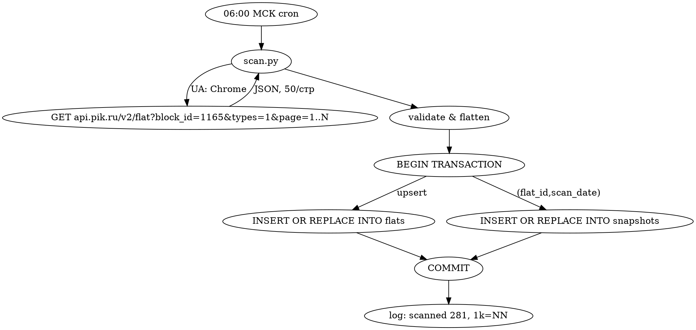

# PIK Нарвин: ежедневный парсер цен — дизайн

**Дата:** 2026-05-15
**Автор:** Дмитрий Горев

## Цель

Каждый день сохранять снимок цен, статусов и параметров **1-комнатных** квартир в ЖК Нарвин (PIK, slug `narvin`, `block_id=1165`). Сегодняшний срез публиковать как фильтруемую таблицу на **`https://pik.gorev.space`**. История по дням должна сохраняться в SQLite, чтобы позже добавить графики цен и алерты.

## Источник данных

PIK сайт `https://www.pik.ru` отдаёт HTML под защитой QRATOR (401 для не-браузеров), но публичный JSON-эндпоинт работает с обычным `User-Agent`:

```
GET https://api.pik.ru/v2/flat?block_id=1165&types=1&page=N
```

- `block_id=1165` — Нарвин (резолвится через `/flat/{id}` → `block_id`)
- `types=1` — квартиры (не коммерция)
- `page=N` — постранично, 50 элементов на страницу
- Total для Нарвина: `count=281` (все комнатности), ~6 страниц
- Требует `User-Agent` любого реального браузера (без него отдаётся кешированный ответ всего PIK)

Поля в ответе (используем подмножество):

```
id, guid, status, type_id, block_id, bulk_id, section_id, layout_id,
floor, number, number_stage, rooms, rooms_fact,
area, area_kitchen, area_living, area_bti, area_project,
price, meterPrice, oldPrice, discount,
finish, finishes[], ceilingHeight, parkingType,
name, address, url, pdf, settlementDate, updatedAt,
benefits (mortgage,...), labels[], attributes[]
```

Фильтрация 1-комнатных делается клиентски: `rooms == 1` (студии — это `rooms == "studio"`, исключаем по умолчанию; пишем в БД, но не показываем).

## Архитектура

Три независимых компонента в `/opt/pik/` (на том же VPS `31.31.197.22`, что `lmf` и `websh-m`).

```
┌──────────────┐  cron 06:00 МСК   ┌─────────────────────┐
│  scan.py     │ ──────────────▶  │  /opt/pik/data/     │
│  (Python)    │                  │     pik.db (SQLite) │
└──────────────┘                  └─────────┬───────────┘
                                            │ datasette serve --port 5051
                                            ▼
                                  ┌─────────────────────┐
                                  │  pik.service        │
                                  │  (systemd)          │
                                  └─────────┬───────────┘
                                            │ proxy_pass
                                            ▼
                       https://pik.gorev.space (nginx + Let's Encrypt)
```

### Компоненты

1. **`scan.py`** — однопроходный скрипт:
   - GET всех страниц `/v2/flat?block_id=1165&types=1&page=N` пока не вернётся пустой `flats`
   - Защита от моргающих ошибок: при `502` или пустой странице — retry с экспоненциальной паузой (3 попытки, 1s/5s/15s)
   - Пишет в SQLite атомарно: одна транзакция на весь скан
   - Пишет лог в `/opt/pik/data/scan.log` (ротация systemd journald)
   - Идемпотентен внутри одного дня: повторный запуск перезаписывает сегодняшний срез
   - Запускается из cron каждый день в 06:00 МСК (тарифные изменения PIK обычно ночью)

2. **`pik.db` (SQLite, две таблицы)**

   ```sql
   -- стабильные характеристики квартиры
   CREATE TABLE flats (
     id            INTEGER PRIMARY KEY,
     guid          TEXT NOT NULL,
     block_id      INTEGER NOT NULL,
     bulk_id       INTEGER,
     section_id    INTEGER,
     layout_id     INTEGER,
     bulk_name     TEXT,           -- 'Корпус 1.1'
     section_no    INTEGER,
     floor         INTEGER,
     rooms         TEXT,           -- 'studio' | '1' | '2' | '3'
     rooms_fact    INTEGER,
     is_studio     INTEGER,
     area          REAL,
     area_kitchen  REAL,
     area_living   REAL,
     number        TEXT,
     name          TEXT,           -- 'Нарвин-1.3(кв)-3/7/4(1)'
     url           TEXT,
     pdf_url       TEXT,
     plan_url      TEXT,
     ceiling_height REAL,
     settlement_date TEXT,
     first_seen    TEXT NOT NULL   -- date('now')
   );

   -- ежедневный срез
   CREATE TABLE snapshots (
     flat_id       INTEGER NOT NULL,
     scan_date     TEXT NOT NULL,  -- 'YYYY-MM-DD' МСК
     scan_ts       TEXT NOT NULL,  -- ISO 8601
     status        TEXT,           -- 'free' | 'sold' | 'reserved'
     price         INTEGER,
     meter_price   INTEGER,
     old_price     INTEGER,
     discount      INTEGER,
     finish        TEXT,
     mortgage_min_rate REAL,       -- мин. ставка по доступным программам, %
     mortgage_best_name TEXT,
     updated_at    TEXT,           -- updatedAt из API
     PRIMARY KEY (flat_id, scan_date),
     FOREIGN KEY (flat_id) REFERENCES flats(id)
   );

   -- view для сегодняшней витрины (Datasette показывает её по умолчанию)
   CREATE VIEW today_one_room AS
     SELECT
       f.id, f.bulk_name, f.section_no AS секция, f.floor AS этаж,
       f.area AS площадь, f.rooms AS комнатность,
       s.price AS цена, s.meter_price AS "цена_за_м²",
       s.status, s.finish AS отделка,
       s.mortgage_min_rate AS "мин_ставка_%", s.mortgage_best_name AS программа,
       f.settlement_date AS заселение, f.url AS ссылка
     FROM flats f
     JOIN snapshots s ON f.id = s.flat_id
     WHERE s.scan_date = date('now', 'localtime')
       AND f.rooms = '1';
   ```

   - Индексы: `idx_snap_date` на `snapshots(scan_date)`, `idx_flat_rooms` на `flats(rooms)`
   - Размер за год: ~300 квартир × 365 дней × ~200 байт = ~22 МБ. Полностью укладывается в SQLite/Datasette без оптимизаций.

3. **Datasette** — отдача витрины:
   - `datasette serve /opt/pik/data/pik.db --port 5051 --setting truncate_cells_html 0 --metadata /opt/pik/metadata.yml`
   - `metadata.yml` задаёт: заголовок «ЖК Нарвин: 1-комн.», описание, ссылку на репо, и сортировку по умолчанию для view `today_one_room` (по цене)
   - Datasette из коробки даёт: фильтры по любым колонкам, текстовый поиск, сортировку, экспорт в CSV/JSON, постоянные URL для запросов
   - На корне `/` редирект на `/pik/today_one_room`

4. **Nginx + systemd**:
   - `/etc/systemd/system/pik.service` — Type=simple, ExecStart=…, User=pik
   - `/etc/nginx/sites-available/pik.gorev.space` — TLS через certbot, `proxy_pass http://127.0.0.1:5051`
   - DNS-запись `pik.gorev.space → 31.31.197.22` (A-record, как у `lmf`/`websh-m`)

5. **cron**:
   ```
   0 6 * * * /opt/pik/venv/bin/python /opt/pik/bin/scan.py >> /opt/pik/data/scan.log 2>&1
   ```

## Поток данных одного скана



## Обработка ошибок

- Сеть/таймаут → 3 ретрая с 1s/5s/15s, после — exit code 2, cron шлёт в journald, человек видит на проверке
- HTTP 502/503 (PIK иногда мигает) → ретрай как выше
- JSON-парсинг падает → log + exit 3, ничего в БД не пишется (транзакция откатывается)
- Если за день уже был скан — `INSERT OR REPLACE` корректно перезапишет
- Если страница вернула 0 элементов до того как набралось `count` → log warn, но коммитим что есть (частичный срез лучше пустого)

## Что НЕ делаем (YAGNI)

- Нет Telegram-уведомлений (пользователь явно отложил)
- Нет графиков и trend-анализа на странице (есть только сегодняшний срез; графики позже через Datasette + plugins или собственный шаблон)
- Нет студий и 2/3-к на витрине (хотя в БД они есть — для будущего расширения)
- Нет авторизации на странице (публичные данные)
- Нет тестов на парсинг каждого поля API: достаточно интеграционного теста, который убеждается что `scan.py --dry-run` отдаёт ≥1 квартиру с непустыми `price`/`area`/`floor`. Пишем тесты на функции маппинга и на upsert-логику (snapshot за тот же день перезаписывается)
- Нет docker — обычное venv, как в `lmf`/`websh-m`

## Раскладка файлов

```
/opt/pik/
├── bin/
│   └── scan.py             # entrypoint
├── pik/                    # python пакет
│   ├── __init__.py
│   ├── client.py           # тонкий HTTP-клиент: get_flats(block_id, types) → list[dict]
│   ├── schema.sql          # DDL
│   ├── store.py            # upsert flats + snapshots в одной транзакции
│   └── mapping.py          # JSON → строки flats/snapshots
├── tests/
│   ├── test_mapping.py     # детерминированный fixture → ожидаемые строки
│   ├── test_store.py       # in-memory SQLite, проверка upsert
│   └── test_client.py      # мокаем requests, проверяем пагинацию и ретраи
├── metadata.yml            # для Datasette
├── data/
│   ├── pik.db
│   └── scan.log
└── venv/
```

В репозитории `/home/sber/gorev/pik-parser/`:
- `bin/scan.py`, `pik/*`, `tests/*`, `metadata.yml`
- `deploy/pik.service`, `deploy/nginx-pik.gorev.space.conf`, `deploy/install.sh`
- `README.md` с инструкцией по развёртыванию

## План работ

1. Реализовать `pik/client.py` с retry + UA + пагинацией (TDD)
2. Реализовать `pik/mapping.py` (JSON → dict для БД) (TDD)
3. Реализовать `pik/store.py` (apply schema + upsert) (TDD)
4. Реализовать `bin/scan.py` (cli, тонкий)
5. Прогнать локально, посмотреть содержимое `today_one_room`
6. Подготовить deploy/* (systemd, nginx, install)
7. Развернуть на сервере, прописать DNS, certbot, запустить разово
8. Поставить cron, проверить, что завтра в 06:00 он сработает
9. Прислать ссылку https://pik.gorev.space с сегодняшним срезом

## Открытые вопросы (минорные)

- **Часовой пояс БД**: используем МСК (`SET TIME ZONE 'Europe/Moscow'` для `date('now', 'localtime')`). Сервер уже на UTC, но SQLite `localtime` модификатор работает с локалью процесса — `datasette.service` будет запущен с `Environment=TZ=Europe/Moscow`
- **Студии**: пишутся в БД (`rooms='studio'`), но на витрине `today_one_room` исключены через `WHERE rooms='1'`. Можно по запросу пользователя одной строчкой включить
- **`updatedAt` из API**: сохраняем, потом сравнение позволит вычислять «давно ли менялось» без сравнения дневных снимков
